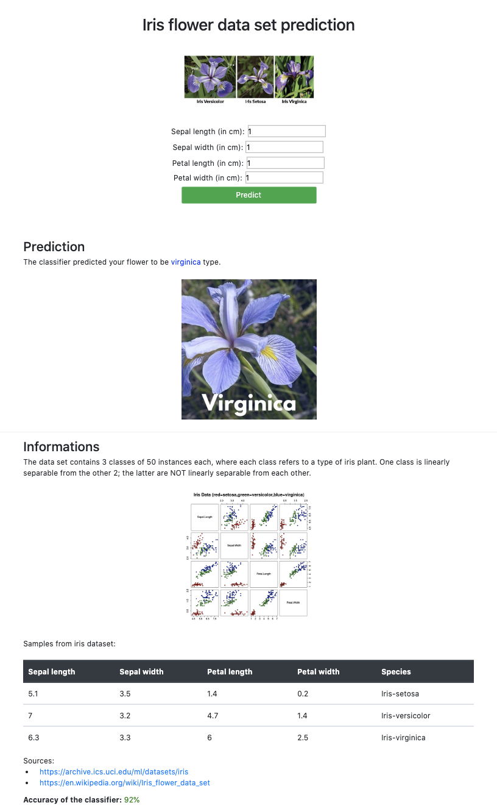

# Simple Machine Learning App

An academic project that includes some of the concepts covered during the "DevOps for Data Science" course DSIA-5201A at ESIEE Paris.

**Keywords:** Machine learning, DevOps, Flask, Python, Docker

**Authors:**

- [Vincent Barbosa Vaz](https://www.linkedin.com/in/vincent-barbosa-vaz/)
- Dhanashri Rajput
- [Clea Ngouansavanh](https://www.linkedin.com/in/cl%C3%A9a-ngouansavanh-155766182/)
- Elias Bouillanne

**Teacher:** [Pouya Yousefi](https://www.linkedin.com/in/pouyaconsulting/)

**Course unit:** DSIA-5201A (ESIEE Paris)

## Course Objective

* Know what to expect in enterprise

  * Understand tools, processes, and techniques for deploying data science software into a production environment as
you would in a corporate role.
  * Look at a dataset and / or business problem  and provide solutions
  * Be able to talk and understand data science software dev and infrastructure
  * Be able to speak Agile & Scrum

* Know your worth

  * Developer
  * Data Scientist: Machine Learning Engineer
  * DevOps: Site Reliability Engineer, Infrastructure Engineer, Cloud Engineer

## App preview

**Checkout the app:** [https://simple-iris-webapp.herokuapp.com/](https://simple-iris-webapp.herokuapp.com/)

Note: The website may also be down from time to time (free plan).

Heroku: [Build apps for free on Heroku](https://www.heroku.com/free)



## Running the project

1. **cd** into **DSIA5201A_app**
2. Create the environment **[1]**
3. Activate the environment and install libraries **[2]**
4. Export the environment variable and run the app **[3]**

**Exit the project:**

5. Quit the application with **CTRL+C**
6. Deactivate the environment **[4]**

**[1] Create the environment**

```bash
python3 -m venv venv/
```

**[2] Activate the environment and install libraries**

```bash
. venv/bin/activate
pip install -r requirements.txt
```

Ensure that you are using the right **pip**:

```bash
which pip
```

Output should be something like : *path_to/DSIA5201A/DSIA5201A_app/venv/bin/pip*

If not:

```bash
alias pip=path_to/DSIA5201A/DSIA5201A_app/venv/bin/pip
```

Alternatively you can specify the path to the **pip** binary you want to use before any pip command:

```bash
path_to/venv/bin/pip yourcommand
```

**[3] Export the environment variable and run the app**

```bash
export FLASK_APP=DSIA5201A_app
pip install -e .
python3 -m flask run
```

**[4] Deactivate the environment**

```bash
deactivate
```

**Misc**

Output installed packages in requirements format (alternative *pip list*):

```bash
pip freeze
```

Generate a requirements file:

```bash
pip freeze > requirements.txt
```

Turn on the development features

```bash
export FLASK_ENV=development
```

## Project structure

**simple-iris-webapp/DSIA5201A_app/**: the app

**simple-iris-webapp/DSIA5201A_app/DSIA5201A_app/static/ai/**: python code to build the classifier

## Running the app within a docker container

**If you want to rebuild manually the docker image**

*cd* into DSIA5201A_app folder:

```bash
cd path_to/DSIA5201A_app
```

Create the docker containers (depending on your computer and your connexion this operation can take a while)

```bash
docker build -t app_flask:latest .
```
**If you don't want to rebuild manually the docker image**

Fetch the image from docker hub:

```bash
docker pull eliasbouillanne/dsia5201_group4:latest
```

**Launch the container**

```bash
docker run -p 5000:5000 app_flask
```

Open: http://localhost:5000/
